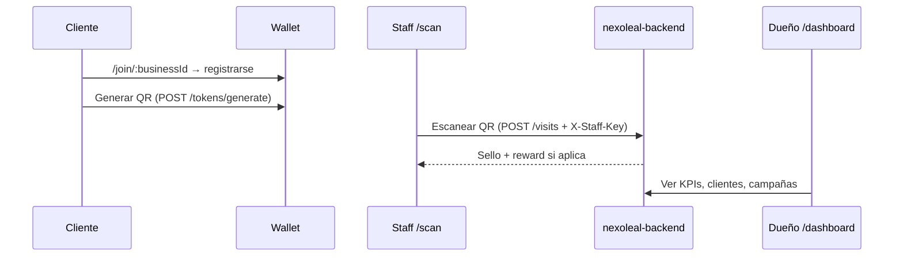
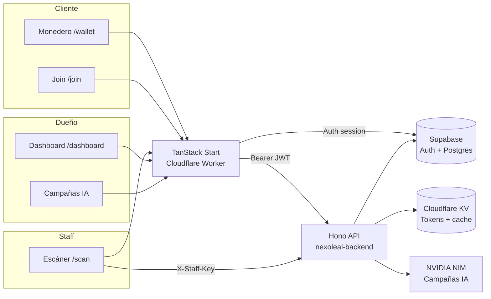

# NexoLeal

**Motor de Lealtad y Retención para PYMES latinoamericanas**

> **Estado del sistema (2026-05-24):** ✅ Cloudflare · ✅ Supabase · ✅ CI · 25 tests passing  
> Ver auditoría completa: [`docs/HEALTH.md`](docs/HEALTH.md)

[](https://github.com/Jose-Gael-Cruz-Lopez/GTM-Builds/actions/workflows/backend-ci.yml)
[](https://github.com/Jose-Gael-Cruz-Lopez/GTM-Builds/actions/workflows/frontend-ci.yml)
[](https://tanstack-start-app.nexoleal.workers.dev)
[](https://nexoleal-backend.nexoleal.workers.dev/health)

📋 Registro de Issues

🟢 Pendientes de Solución

[ ] **Generación de QR:** Error persistente de "Client profile not found. Call POST /consumer/register first." que impide la visualización del código QR.

[ ] **Validación de QR:** Falta implementar y verificar la lógica de validación para los códigos QR escaneados.

[ ] **Rendimiento del Asistente IA:** El proceso de creación de resúmenes por parte del asistente de IA presenta una latencia elevada.

[ ] **Navegación del Asistente:** El botón "Volver al panel" dentro de la interfaz del asistente de IA no ejecuta ninguna acción.

[ ] **Funcionalidad de la Barra Lateral:** Los apartados de "Sucursales", "Clientes" y "Visitas" carecen de funcionalidad implementada actualmente.

[ ] **Botones "Segmentos en riesgo":** Al interactuar con estos botones, el panel principal se recarga sin actualizar la información o mostrar el contenido esperado.


## Producción (Cloudflare Workers)

| Servicio | Worker | URL |
|----------|--------|-----|
| **App (frontend)** | `tanstack-start-app` | https://tanstack-start-app.nexoleal.workers.dev |
| **API (backend)** | `nexoleal-backend` | https://nexoleal-backend.nexoleal.workers.dev |
| **Health check** | — | https://nexoleal-backend.nexoleal.workers.dev/health |
| **Supabase** | — | https://lajrjnjyvbpaaspzgpvh.supabase.co |

**Último deploy (2026-05-24):** PRs #7–#9 merged. Workers: `tanstack-start-app` + `nexoleal-backend` (2 workers only).

| Entorno local | URL |
|---------------|-----|
| Frontend dev | http://localhost:8080 |
| Backend dev | http://localhost:8787 |

NexoLeal digitaliza programas de lealtad para PYMES: monedero digital para clientes, escáner seguro para staff, y dashboard con campañas IA para dueños de negocio.

---

## Tabla de contenidos

1. [Quick start](#quick-start)
2. [Roles de usuario](#roles-de-usuario)
3. [Problema y solución](#problema)
4. [Stack](#stack)
5. [Arquitectura](#arquitectura)
6. [Estructura del repositorio](#estructura-del-repositorio)
7. [Rutas frontend](#rutas-principales-frontend)
8. [API backend](#api-completa-backend)
9. [Desarrollo local](#desarrollo-local)
10. [Supabase](#base-de-datos-supabase)
11. [Deploy](#deploy)
12. [Autenticación](#autenticación)
13. [Anti-fraude QR](#anti-fraude-qr-tokens)
14. [Troubleshooting](#troubleshooting)
15. [Documentación](#documentación-para-agentes)

---

## Quick start

```bash
# 1. Clone and install
git clone https://github.com/Jose-Gael-Cruz-Lopez/GTM-Builds.git
cd GTM-Builds

# 2. Backend (terminal 1)
cd backend && cp .dev.vars.example .dev.vars && npm ci && npm run dev

# 3. Frontend (terminal 2)
cd frontend && cp .env.example .env && npm ci && npm run dev

# 4. Open
open http://localhost:8080
```

Production app (no install): https://tanstack-start-app.nexoleal.workers.dev

---

## Roles de usuario

| Rol | Auth | Rutas principales | Qué puede hacer |
|-----|------|-------------------|-----------------|
| **Dueño** | Supabase email/password | `/dashboard/*`, `/campaigns/*`, `/settings/*` | KPIs, clientes, visitas, campañas IA, config, staff keys |
| **Staff** | `X-Staff-Key` header | `/scan` | Escanear QR del cliente, registrar visitas |
| **Cliente** | Supabase (Google o email) | `/join/*`, `/wallet/*` | Unirse al programa, ver sellos, generar QR 90s |
| **Público** | — | `/`, `/login`, `/signup` | Landing, registro de negocio |

### Flujo típico



---

## Problema

Las PYMES de servicios (barberías, estéticas, veterinarias, cafeterías) pierden datos con tarjetas físicas, sufren fraude de sellos, y no detectan cuándo un cliente deja de regresar.

## Solución

| Componente | Usuario | Función |
|------------|---------|---------|
| **Monedero digital** | Cliente | Sellos, QR temporal, recompensas |
| **Escáner staff** | Caja / staff | Valida QR, registra visitas, offline queue |
| **Dashboard + IA** | Dueño | KPIs, clientes en riesgo, campañas WhatsApp |

---

## Stack

| Capa | Tecnología |
|------|------------|
| **Frontend** | TanStack Start (React 19) + Vite + Tailwind CSS 4 |
| **Backend** | Cloudflare Workers + Hono.js |
| **Base de datos** | Supabase (PostgreSQL + Auth) |
| **Tokens QR** | HMAC-SHA256, TTL 90 s, blacklist en KV |
| **Staff auth** | API keys hasheadas (`X-Staff-Key`) |
| **IA / Campañas** | NVIDIA NIM (`meta/llama-3.3-70b-instruct`) |
| **Cache / rate limit** | Cloudflare KV |
| **CI/CD** | GitHub Actions → Cloudflare Workers |

---

## Arquitectura



---

## Estructura del repositorio

```
GTM-Builds/
├── backend/                    # Cloudflare Worker (Hono API)
│   ├── src/
│   │   ├── index.ts            # App + cron export
│   │   ├── cron.ts             # Recalcula status active/at_risk/lost
│   │   ├── lib/                # supabase, tokenEngine, nim
│   │   ├── middleware/         # auth, rateLimit, errorHandler
│   │   └── routes/             # tokens, businesses, clients, visits, campaigns
│   ├── supabase-schema.sql     # Schema idempotente (SQL Editor)
│   ├── wrangler.toml
│   └── DEPLOY.md
├── frontend/                   # TanStack Start app
│   ├── src/
│   │   ├── routes/             # File-based routing
│   │   ├── components/         # dashboard, scan, campaigns, settings, …
│   │   ├── lib/api/            # Typed API client
│   │   └── integrations/supabase/
│   ├── .env.production         # Build env (committed, anon key)
│   ├── supabase/migrations/    # Migraciones incrementales
│   ├── public/                 # PWA manifest, service worker, OG image
│   └── wrangler.jsonc          # Worker config + runtime vars
├── docs/
│   ├── CHANGELOG.md            # Release notes
│   ├── VERIFICATION.md         # Post-deploy checklist
│   ├── CONTRIBUTING.md         # Branch workflow + checks
│   └── archive/                # Prompts completados
├── prompts/                    # Prompts originales de construcción (agentes)
└── .github/workflows/          # backend-ci.yml, frontend-ci.yml
```

---

## Rutas principales (frontend)

| Ruta | Auth | Descripción |
|------|------|-------------|
| `/` | Público | Landing marketing |
| `/login`, `/signup` | Público | Auth dueño/cliente |
| `/forgot-password`, `/reset-password` | Público | Recuperación de contraseña |
| `/auth/callback` | Público | Callback OAuth Supabase |
| `/onboarding` | Dueño | Marca → recompensa → QR join + staff key |
| `/dashboard/:businessId` | Dueño | Panel KPIs, gráficas, churn |
| `/dashboard/:businessId/clients` | Dueño | Lista paginada + filtros status |
| `/dashboard/:businessId/visits` | Dueño | Feed de visitas |
| `/dashboard/:businessId/redemptions` | Dueño | Recompensas por entregar |
| `/campaigns/:businessId` | Dueño | Campañas IA + WhatsApp copy |
| `/settings/:businessId` | Dueño | General, lealtad, staff, cuenta |
| `/scan` | Staff key | Escáner QR cámara |
| `/join/:businessId` | Cliente | Unirse al programa |
| `/wallet`, `/wallet/:businessId` | Cliente | Monedero digital |
| `/wallet/profile` | Cliente | Perfil del cliente |
| `/privacy`, `/terms` | Público | Legal |

---

## API completa (backend)

Base URL: `https://nexoleal-backend.nexoleal.workers.dev`  
Envelope: `{ "success": true, "data": {…} }` o `{ "success": false, "error": { "code", "message" } }`

### Health

| Método | Ruta | Auth | Descripción |
|--------|------|------|-------------|
| `GET` | `/health` | — | Estado del worker |

### Tokens (QR)

| Método | Ruta | Auth | Descripción |
|--------|------|------|-------------|
| `POST` | `/tokens/generate` | Bearer (cliente) | Genera QR firmado (90s TTL) |
| `POST` | `/tokens/validate` | — | Valida token (staff pre-scan) |
| `POST` | `/tokens/invalidate` | — | Invalida token manualmente |

### Visits

| Método | Ruta | Auth | Descripción |
|--------|------|------|-------------|
| `POST` | `/visits` | X-Staff-Key | Registra visita + sellos |
| `GET` | `/visits/business-visits?businessId=` | Bearer (owner) | Feed admin |
| `GET` | `/visits/:visitId` | Bearer | Detalle de visita |
| `GET` | `/visits/me/visits` | Bearer (cliente) | Historial propio |

### Clients

| Método | Ruta | Auth | Descripción |
|--------|------|------|-------------|
| `POST` | `/clients` | Bearer (cliente) | Registrar/actualizar perfil |
| `GET` | `/clients/me` | Bearer (cliente) | Mi perfil |
| `GET` | `/clients/me/loyalty` | Bearer (cliente) | Todas mis tarjetas |
| `GET` | `/clients/me/loyalty/:businessId` | Bearer (cliente) | Lealtad por negocio |
| `GET` | `/clients/businesses-clients?businessId=` | Bearer (owner) | Lista admin |
| `GET` | `/clients/at-risk?businessId=` | Bearer (owner) | Clientes en riesgo |

### Businesses

| Método | Ruta | Auth | Descripción |
|--------|------|------|-------------|
| `POST` | `/businesses` | Bearer | Crear negocio (signup) |
| `GET` | `/businesses/:id` | Bearer | Perfil del negocio |
| `PATCH` | `/businesses/:id` | Bearer (owner) | Actualizar + brand |
| `GET` | `/businesses/:id/loyalty-config` | Bearer | Config lealtad |
| `PATCH` | `/businesses/:id/loyalty-config` | Bearer (owner) | Editar sellos/recompensa |
| `GET` | `/businesses/:id/staff-keys` | Bearer (owner) | Listar keys staff |
| `POST` | `/businesses/:id/staff-keys` | Bearer (owner) | Crear key staff |
| `DELETE` | `/businesses/:id/staff-keys/:keyId` | Bearer (owner) | Revocar key |
| `GET` | `/businesses/:id/rewards` | Bearer (owner) | Recompensas |
| `PATCH` | `/businesses/:id/rewards/:rewardId` | Bearer (owner) | Marcar entregada |
| `GET` | `/businesses/:id/stats/summary` | Bearer (owner) | KPIs dashboard |

### Analytics

| Método | Ruta | Auth | Descripción |
|--------|------|------|-------------|
| `GET` | `/businesses/:id/retention` | Bearer (owner) | Retención 30/60/90d |
| `GET` | `/businesses/:id/visits?days=` | Bearer (owner) | Gráfica visitas |
| `GET` | `/businesses/:id/clients` | Bearer (owner) | Analytics clientes |
| `GET` | `/businesses/:id/peak-hours` | Bearer (owner) | Horas pico |
| `GET` | `/businesses/:id/churn-risk` | Bearer (owner) | Riesgo de churn |

### Campaigns

| Método | Ruta | Auth | Descripción |
|--------|------|------|-------------|
| `POST` | `/businesses/:id/campaigns/generate` | Bearer (owner) | Generar 3 borradores IA |
| `GET` | `/businesses/:id/campaigns` | Bearer (owner) | Listar campañas |
| `GET` | `/businesses/:id/campaigns/:campaignId` | Bearer (owner) | Detalle |
| `POST` | `/businesses/:id/campaigns/:campaignId/activate` | Bearer (owner) | Activar |
| `PATCH` | `/businesses/:id/campaigns/:campaignId` | Bearer (owner) | Editar / marcar enviada |
| `GET` | `/businesses/:id/campaigns/:campaignId/stats` | Bearer (owner) | Stats de campaña |

Ver [`backend/DEPLOY.md`](backend/DEPLOY.md) para secrets y deploy.

---

## Desarrollo local

### Backend

```bash
cd backend
cp .dev.vars.example .dev.vars   # llenar keys de Supabase, TOKEN_SECRET, NIM
npm ci
npm run dev                      # http://localhost:8787
npm test                         # 25 tests
```

### Frontend

```bash
cd frontend
cp .env.example .env             # keys públicas de Supabase + VITE_API_URL
npm ci
npm run dev                      # http://localhost:8080
npm run lint
npx tsc --noEmit
npm run build
```

Variables frontend:

| Archivo | Uso |
|---------|-----|
| `.env` | Desarrollo local (copiar de `.env.example`) |
| `.env.production` | Build de producción + CI (committed, anon key pública) |
| `wrangler.jsonc` → `vars` | Runtime SSR en Cloudflare Worker |

```
VITE_SUPABASE_URL=https://lajrjnjyvbpaaspzgpvh.supabase.co
VITE_SUPABASE_PUBLISHABLE_KEY=<anon key>
VITE_API_URL=http://localhost:8787   # local, o URL de producción
```

---

## Base de datos (Supabase)

**Proyecto:** `lajrjnjyvbpaaspzgpvh` · https://lajrjnjyvbpaaspzgpvh.supabase.co

Guía completa: [`docs/SUPABASE.md`](docs/SUPABASE.md)

### Setup

1. Ejecutar [`backend/supabase-schema.sql`](backend/supabase-schema.sql) en SQL Editor (idempotente).
2. Aplicar migraciones en [`frontend/supabase/migrations/`](frontend/supabase/migrations/) en orden.

### Tablas (8)

| Tabla | Contenido |
|-------|-----------|
| `businesses` | Negocios + brand fields |
| `loyalty_configs` | Sellos requeridos, descripción recompensa |
| `clients` | Perfiles de clientes finales |
| `client_business_loyalty` | Sellos, status (`active`/`at_risk`/`lost`) |
| `visits` | Registro de escaneos staff |
| `rewards` | Recompensas desbloqueadas |
| `campaigns` | Borradores IA + status + `sent_at` |
| `staff_keys` | Keys hasheadas para `/scan` |

### Migración reciente

```sql
-- frontend/supabase/migrations/20260524000000_business_brand_and_campaign_sent.sql
alter table public.businesses add column if not exists tagline text;
alter table public.businesses add column if not exists logo_url text;
alter table public.businesses add column if not exists primary_color text;
alter table public.campaigns add column if not exists sent_at timestamptz;
```

---

## Deploy

### Cloudflare Workers

| Target | Worker name | Trigger | Comando manual |
|--------|-------------|---------|----------------|
| Frontend | `tanstack-start-app` | Push a `main` (`frontend/**`) | `cd frontend && npm run build && npx wrangler deploy` |
| Backend | `nexoleal-backend` | Push a `main` (`backend/**`) o manual | `cd backend && npm run deploy` |
| Backend (staging) | `nexoleal-backend-staging` | Push a `develop` | `cd backend && npm run deploy:staging` |

Guías detalladas: [`backend/DEPLOY.md`](backend/DEPLOY.md) · [`frontend/DEPLOY.md`](frontend/DEPLOY.md) · [`docs/ENV.md`](docs/ENV.md)

### Secrets

**Cloudflare (backend worker):** `SUPABASE_URL`, `SUPABASE_ANON_KEY`, `SUPABASE_SERVICE_KEY`, `TOKEN_SECRET`, `NIM_API_KEY`

**Frontend build + runtime:**

| Source | Variables |
|--------|-----------|
| `frontend/.env.production` | `VITE_SUPABASE_*`, `SUPABASE_*`, `VITE_API_URL` (build time) |
| `frontend/wrangler.jsonc` → `vars` | `SUPABASE_URL`, `SUPABASE_PUBLISHABLE_KEY`, `VITE_API_URL` (SSR runtime) |

**GitHub Actions (CI deploy):** `CLOUDFLARE_API_TOKEN`, `CLOUDFLARE_ACCOUNT_ID` — Supabase vars come from committed `.env.production`, not GitHub secrets.

### CORS

El backend permite el origen del frontend vía `FRONTEND_ORIGIN` en [`backend/wrangler.toml`](backend/wrangler.toml) (incluye `localhost:8080` y la URL de Workers).

Guía Cloudflare: [`docs/CLOUDFLARE.md`](docs/CLOUDFLARE.md)

---

## Autenticación

| Mecanismo | Header / storage | Usado en |
|-----------|------------------|----------|
| **Supabase JWT** | `Authorization: Bearer <token>` | Dueño + cliente → API |
| **Staff key** | `X-Staff-Key: <businessId>:<rawKey>` | `/scan` → `POST /visits` |
| **Session (frontend)** | `localStorage` via Supabase JS | Dashboard nav (client-side) |

Dueños verifican ownership via `requireAdmin()` middleware (`businessId` en query o path).  
Clientes usan `requireClient()`. Staff keys se almacenan hasheadas (SHA-256) en `staff_keys`.

---

## Troubleshooting

| Síntoma | Causa probable | Solución |
|---------|----------------|----------|
| `Missing Supabase environment variable(s)` | Build sin `.env.production` | Verificar `frontend/.env.production` + `wrangler.jsonc` vars |
| Sidebar redirige a `/login` | SSR auth check sin session | Fixed PR #7 — redeploy frontend |
| Visitas page error 500 | Route ordering bug | Fixed PR #7 — redeploy backend |
| CORS error en API | Origin no en `FRONTEND_ORIGIN` | Agregar URL a `backend/wrangler.toml` |
| 3 workers en Cloudflare | Legacy `nexoleal-backend-production` | Eliminar worker huérfano (PR #9) |
| CI deploy sin Supabase | GitHub secrets vacíos | Usar `.env.production` committed (PR env fix) |

Más checks: [`docs/VERIFICATION.md`](docs/VERIFICATION.md) · [`docs/HEALTH.md`](docs/HEALTH.md)

---

## Cambios recientes

Ver [`docs/CHANGELOG.md`](docs/CHANGELOG.md) para el historial completo.

| Fecha | Cambio |
|-------|--------|
| 2026-05-24 | PR #8: README overhaul, CHANGELOG, VERIFICATION, ENV docs |
| 2026-05-24 | PR #9: Single backend worker (`nexoleal-backend`), delete duplicate |
| 2026-05-24 | PR #7: sidebar auth fix, visits API route order, business GET RLS, Supabase env en CI |
| 2026-05-24 | `.env.production` + `wrangler.jsonc` vars para builds sin GitHub secrets |
| 2026-05-23 | Revamp frontend prompts 05–12, settings, campaigns IA, redemptions |
| 2026-05-23 | Migración brand fields + `campaigns.sent_at` |

---

## Anti-fraude (QR tokens)

Cada QR está firmado con HMAC-SHA256 y expira en 90 segundos. Tras el primer escaneo válido, el token se invalida en Cloudflare KV.

---

## Documentación para agentes

| Carpeta | Contenido |
|---------|-----------|
| [`prompts/START-HERE.md`](prompts/START-HERE.md) | Punto de entrada |
| [`prompts/backend/`](prompts/backend/) | Construcción del API (10 prompts) |
| [`prompts/frontend-integration/`](prompts/frontend-integration/) | Integración frontend inicial |
| [`docs/archive/frontend-revamp-prompts/`](docs/archive/frontend-revamp-prompts/) | Revamp prompts 05–12 (completados) |
| [`docs/INDEX.md`](docs/INDEX.md) | Índice de toda la documentación |
| [`docs/HEALTH.md`](docs/HEALTH.md) | Auditoría de plataforma (Cloudflare + Supabase + CI) |
| [`docs/SUPABASE.md`](docs/SUPABASE.md) | Setup Supabase, tablas, RLS |
| [`docs/CLOUDFLARE.md`](docs/CLOUDFLARE.md) | Workers, KV, secrets, deploy |
| [`docs/CODE_QUALITY.md`](docs/CODE_QUALITY.md) | Tests, lint, optimizaciones |
| [`docs/CHANGELOG.md`](docs/CHANGELOG.md) | Historial de cambios |
| [`docs/VERIFICATION.md`](docs/VERIFICATION.md) | Checklist post-deploy |
| [`docs/ENV.md`](docs/ENV.md) | Referencia de variables de entorno |
| [`docs/CONTRIBUTING.md`](docs/CONTRIBUTING.md) | Guía de contribución |
| [`docs/PULL_REQUESTS.md`](docs/PULL_REQUESTS.md) | Workflow de PRs |

---

## Visión

Infraestructura de lealtad digital accesible para PYMES en Latinoamérica: conocer clientes, aumentar recurrencia, y crecer con datos reales.
