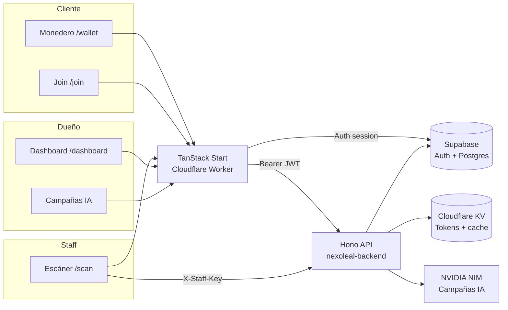

# NexoLeal

**Motor de Lealtad y Retención para PYMES latinoamericanas**

[](https://github.com/Jose-Gael-Cruz-Lopez/GTM-Builds/actions/workflows/backend-ci.yml)
[](https://github.com/Jose-Gael-Cruz-Lopez/GTM-Builds/actions/workflows/frontend-ci.yml)
[](https://tanstack-start-app.nexoleal.workers.dev)
[](https://nexoleal-backend.nexoleal.workers.dev/health)

## Producción (Cloudflare Workers)

| Servicio | Worker | URL |
|----------|--------|-----|
| **App (frontend)** | `tanstack-start-app` | https://tanstack-start-app.nexoleal.workers.dev |
| **API (backend)** | `nexoleal-backend` | https://nexoleal-backend.nexoleal.workers.dev |
| **Health check** | — | https://nexoleal-backend.nexoleal.workers.dev/health |
| **Supabase** | — | https://lajrjnjyvbpaaspzgpvh.supabase.co |

**Último deploy (2026-05-24):** PR #7 merged + env fix. Workers: frontend `b91eca32`, backend `7ce781ed`.

| Entorno local | URL |
|---------------|-----|
| Frontend dev | http://localhost:8080 |
| Backend dev | http://localhost:8787 |

NexoLeal digitaliza programas de lealtad para PYMES: monedero digital para clientes, escáner seguro para staff, y dashboard con campañas IA para dueños de negocio.

---

## Quick start

```bash
# 1. Clone and install
git clone https://github.com/Jose-Gael-Cruz-Lopez/GTM-Builds.git
cd GTM-Builds

# 2. Backend (terminal 1)
cd backend && cp .dev.vars.example .dev.vars && npm ci && npm run dev

# 3. Frontend (terminal 2)
cd frontend && cp .env.example .env && npm ci && npm run dev

# 4. Open
open http://localhost:8080
```

Production app (no install): https://tanstack-start-app.nexoleal.workers.dev

---

## Problema

Las PYMES de servicios (barberías, estéticas, veterinarias, cafeterías) pierden datos con tarjetas físicas, sufren fraude de sellos, y no detectan cuándo un cliente deja de regresar.

## Solución

| Componente | Usuario | Función |
|------------|---------|---------|
| **Monedero digital** | Cliente | Sellos, QR temporal, recompensas |
| **Escáner staff** | Caja / staff | Valida QR, registra visitas, offline queue |
| **Dashboard + IA** | Dueño | KPIs, clientes en riesgo, campañas WhatsApp |

---

## Stack

| Capa | Tecnología |
|------|------------|
| **Frontend** | TanStack Start (React 19) + Vite + Tailwind CSS 4 |
| **Backend** | Cloudflare Workers + Hono.js |
| **Base de datos** | Supabase (PostgreSQL + Auth) |
| **Tokens QR** | HMAC-SHA256, TTL 90 s, blacklist en KV |
| **Staff auth** | API keys hasheadas (`X-Staff-Key`) |
| **IA / Campañas** | NVIDIA NIM (`meta/llama-3.3-70b-instruct`) |
| **Cache / rate limit** | Cloudflare KV |
| **CI/CD** | GitHub Actions → Cloudflare Workers |

---

## Arquitectura



---

## Estructura del repositorio

```
GTM-Builds/
├── backend/                    # Cloudflare Worker (Hono API)
│   ├── src/
│   │   ├── index.ts            # App + cron export
│   │   ├── cron.ts             # Recalcula status active/at_risk/lost
│   │   ├── lib/                # supabase, tokenEngine, nim
│   │   ├── middleware/         # auth, rateLimit, errorHandler
│   │   └── routes/             # tokens, businesses, clients, visits, campaigns
│   ├── supabase-schema.sql     # Schema idempotente (SQL Editor)
│   ├── wrangler.toml
│   └── DEPLOY.md
├── frontend/                   # TanStack Start app
│   ├── src/
│   │   ├── routes/             # File-based routing
│   │   ├── components/         # dashboard, scan, campaigns, settings, …
│   │   ├── lib/api/            # Typed API client
│   │   └── integrations/supabase/
│   ├── .env.production         # Build env (committed, anon key)
│   ├── supabase/migrations/    # Migraciones incrementales
│   ├── public/                 # PWA manifest, service worker, OG image
│   └── wrangler.jsonc          # Worker config + runtime vars
├── docs/
│   ├── CHANGELOG.md            # Release notes
│   ├── VERIFICATION.md         # Post-deploy checklist
│   ├── CONTRIBUTING.md         # Branch workflow + checks
│   └── archive/                # Prompts completados
├── prompts/                    # Prompts originales de construcción (agentes)
└── .github/workflows/          # backend-ci.yml, frontend-ci.yml
```

---

## Rutas principales (frontend)

| Ruta | Descripción |
|------|-------------|
| `/` | Landing |
| `/login`, `/signup` | Auth |
| `/onboarding` | Setup de negocio (marca, recompensa, QR) |
| `/dashboard/:businessId` | Panel del dueño |
| `/dashboard/:businessId/clients` | Lista de clientes |
| `/dashboard/:businessId/visits` | Feed de visitas |
| `/dashboard/:businessId/redemptions` | Recompensas pendientes |
| `/campaigns/:businessId` | Campañas IA + WhatsApp |
| `/settings/:businessId` | Configuración (general, lealtad, staff, cuenta) |
| `/scan` | Escáner staff |
| `/join/:businessId` | Unirse al programa (cliente) |
| `/wallet/:businessId` | Monedero del cliente |

---

## API principal (backend)

| Método | Ruta | Auth | Descripción |
|--------|------|------|-------------|
| `GET` | `/health` | — | Estado del worker |
| `POST` | `/tokens/generate` | Bearer JWT | Genera QR token |
| `POST` | `/tokens/validate` | X-Staff-Key | Valida y consume QR |
| `POST` | `/visits` | X-Staff-Key | Registra visita |
| `GET` | `/businesses/:id` | Bearer JWT | Perfil del negocio (service role tras auth) |
| `GET` | `/clients/businesses-clients?businessId=` | Bearer JWT (owner) | Lista clientes |
| `GET` | `/visits/business-visits?businessId=` | Bearer JWT (owner) | Feed visitas (ruta fija, no `/:visitId`) |
| `GET` | `/businesses/:id/rewards` | Bearer JWT (owner) | Recompensas |
| `PATCH` | `/businesses/:id` | Bearer JWT (owner) | Actualizar negocio + marca |
| `PATCH` | `/businesses/:id/campaigns/:id` | Bearer JWT (owner) | Editar / marcar enviada |
| `POST` | `/businesses/:id/campaigns/generate` | Bearer JWT (owner) | Campaña IA |

Ver [`backend/DEPLOY.md`](backend/DEPLOY.md) para la lista completa de secrets y deploy.

---

## Desarrollo local

### Backend

```bash
cd backend
cp .dev.vars.example .dev.vars   # llenar keys de Supabase, TOKEN_SECRET, NIM
npm ci
npm run dev                      # http://localhost:8787
npm test                         # 25 tests
```

### Frontend

```bash
cd frontend
cp .env.example .env             # keys públicas de Supabase + VITE_API_URL
npm ci
npm run dev                      # http://localhost:8080
npm run lint
npx tsc --noEmit
npm run build
```

Variables frontend:

| Archivo | Uso |
|---------|-----|
| `.env` | Desarrollo local (copiar de `.env.example`) |
| `.env.production` | Build de producción + CI (committed, anon key pública) |
| `wrangler.jsonc` → `vars` | Runtime SSR en Cloudflare Worker |

```
VITE_SUPABASE_URL=https://lajrjnjyvbpaaspzgpvh.supabase.co
VITE_SUPABASE_PUBLISHABLE_KEY=<anon key>
VITE_API_URL=http://localhost:8787   # local, o URL de producción
```

---

## Base de datos (Supabase)

1. Ejecutar [`backend/supabase-schema.sql`](backend/supabase-schema.sql) en el SQL Editor (idempotente).
2. Aplicar migraciones incrementales en [`frontend/supabase/migrations/`](frontend/supabase/migrations/) según se agreguen.

Migración reciente (brand fields + `sent_at`):

```sql
-- frontend/supabase/migrations/20260524000000_business_brand_and_campaign_sent.sql
alter table public.businesses add column if not exists tagline text;
alter table public.businesses add column if not exists logo_url text;
-- … (ver archivo completo)
```

---

## Deploy

### Cloudflare Workers

| Target | Worker name | Trigger | Comando manual |
|--------|-------------|---------|----------------|
| Frontend | `tanstack-start-app` | Push a `main` (`frontend/**`) | `cd frontend && npm run build && npx wrangler deploy` |
| Backend (default) | `nexoleal-backend` | Manual o `wrangler deploy` | `cd backend && npx wrangler deploy` |
| Backend (CI prod env) | `nexoleal-backend-production` | Push a `main` (`backend/**`) | `cd backend && npm run deploy:production` |
| Backend (staging) | `nexoleal-backend-staging` | Push a `develop` | `cd backend && npm run deploy:staging` |

Guías detalladas: [`backend/DEPLOY.md`](backend/DEPLOY.md) · [`frontend/DEPLOY.md`](frontend/DEPLOY.md)

### Secrets

**Cloudflare (backend worker):** `SUPABASE_URL`, `SUPABASE_ANON_KEY`, `SUPABASE_SERVICE_KEY`, `TOKEN_SECRET`, `NIM_API_KEY`

**Frontend build + runtime:**

| Source | Variables |
|--------|-----------|
| `frontend/.env.production` | `VITE_SUPABASE_*`, `SUPABASE_*`, `VITE_API_URL` (build time) |
| `frontend/wrangler.jsonc` → `vars` | `SUPABASE_URL`, `SUPABASE_PUBLISHABLE_KEY`, `VITE_API_URL` (SSR runtime) |

**GitHub Actions (CI deploy):** `CLOUDFLARE_API_TOKEN`, `CLOUDFLARE_ACCOUNT_ID` — Supabase vars come from committed `.env.production`, not GitHub secrets.

### CORS

El backend permite el origen del frontend vía `FRONTEND_ORIGIN` en [`backend/wrangler.toml`](backend/wrangler.toml) (incluye `localhost:8080` y la URL de Workers).

---

## Cambios recientes

Ver [`docs/CHANGELOG.md`](docs/CHANGELOG.md) para el historial completo.

| Fecha | Cambio |
|-------|--------|
| 2026-05-24 | PR #7: sidebar auth fix, visits API route order, business GET RLS, Supabase env en CI |
| 2026-05-24 | `.env.production` + `wrangler.jsonc` vars para builds sin GitHub secrets |
| 2026-05-23 | Revamp frontend prompts 05–12, settings, campaigns IA, redemptions |
| 2026-05-23 | Migración brand fields + `campaigns.sent_at` |

---

## Anti-fraude (QR tokens)

Cada QR está firmado con HMAC-SHA256 y expira en 90 segundos. Tras el primer escaneo válido, el token se invalida en Cloudflare KV.

---

## Documentación para agentes

| Carpeta | Contenido |
|---------|-----------|
| [`prompts/START-HERE.md`](prompts/START-HERE.md) | Punto de entrada |
| [`prompts/backend/`](prompts/backend/) | Construcción del API (10 prompts) |
| [`prompts/frontend-integration/`](prompts/frontend-integration/) | Integración frontend inicial |
| [`docs/archive/frontend-revamp-prompts/`](docs/archive/frontend-revamp-prompts/) | Revamp prompts 05–12 (completados) |
| [`docs/CHANGELOG.md`](docs/CHANGELOG.md) | Historial de cambios |
| [`docs/VERIFICATION.md`](docs/VERIFICATION.md) | Checklist post-deploy |
| [`docs/CONTRIBUTING.md`](docs/CONTRIBUTING.md) | Guía de contribución |

---

## Visión

Infraestructura de lealtad digital accesible para PYMES en Latinoamérica: conocer clientes, aumentar recurrencia, y crecer con datos reales.
