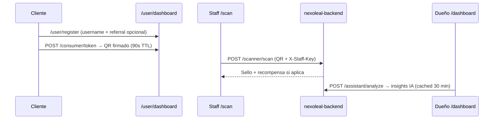
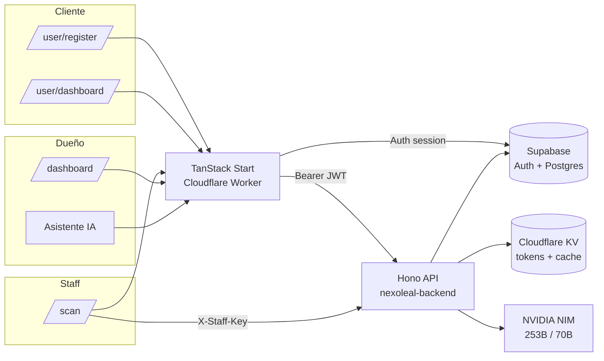

# NexoLeal

**Motor de lealtad y retención para PYMES latinoamericanas.**

Monedero digital para clientes, escáner seguro para staff, dashboard con asistente IA para dueños — todo sobre Cloudflare Workers + Supabase.

[](https://github.com/Jose-Gael-Cruz-Lopez/GTM-Builds/actions/workflows/backend-ci.yml)
[](https://github.com/Jose-Gael-Cruz-Lopez/GTM-Builds/actions/workflows/frontend-ci.yml)
[](https://tanstack-start-app.nexoleal.workers.dev)
[](https://nexoleal-backend.nexoleal.workers.dev/health)

| Servicio | URL |
|----------|-----|
| **App (frontend)** | https://tanstack-start-app.nexoleal.workers.dev |
| **API (backend)** | https://nexoleal-backend.nexoleal.workers.dev |
| **Health check** | https://nexoleal-backend.nexoleal.workers.dev/health |
| **Supabase** | https://lajrjnjyvbpaaspzgpvh.supabase.co |

**Estado:** ✅ 40 backend tests · ✅ frontend + backend CI verdes · ✅ caching activo en `/assistant/analyze` (TTL 30 min)

---

## Tabla de contenidos

1. [Quick start](#quick-start)
2. [El problema](#el-problema)
3. [Roles de usuario](#roles-de-usuario)
4. [Stack](#stack)
5. [Arquitectura](#arquitectura)
6. [Estructura del repositorio](#estructura-del-repositorio)
7. [Rutas (frontend)](#rutas-frontend)
8. [API (backend)](#api-backend)
9. [Desarrollo local](#desarrollo-local)
10. [Base de datos (Supabase)](#base-de-datos-supabase)
11. [Deploy](#deploy)
12. [Autenticación](#autenticación)
13. [Anti-fraude (QR tokens)](#anti-fraude-qr-tokens)
14. [Caching y performance](#caching-y-performance)
15. [Testing](#testing)
16. [Troubleshooting](#troubleshooting)
17. [Cambios recientes](#cambios-recientes)
18. [Documentación interna](#documentación-interna)

---

## Quick start

```bash
git clone https://github.com/Jose-Gael-Cruz-Lopez/GTM-Builds.git
cd GTM-Builds

# Backend (terminal 1)
cd backend && cp .dev.vars.example .dev.vars && npm ci && npm run dev
# → http://localhost:8787

# Frontend (terminal 2)
cd frontend && cp .env.example .env && npm ci && npm run dev
# → http://localhost:8080
```

Sin instalar nada: **https://tanstack-start-app.nexoleal.workers.dev**

---

## El problema

Las PYMES de servicios (barberías, estéticas, veterinarias, cafeterías) pierden datos con tarjetas físicas, sufren fraude de sellos, y no detectan cuándo un cliente deja de regresar.

### La solución

| Componente | Para | Función |
|------------|------|---------|
| **Monedero digital** | Cliente | QR temporal de 90s, sellos, recompensas |
| **Escáner staff** | Caja / mostrador | Valida QR, registra visitas, idempotente |
| **Dashboard + IA** | Dueño | KPIs, segmentos en riesgo, campañas WhatsApp |

---

## Roles de usuario

| Rol | Auth | Rutas | Qué puede hacer |
|-----|------|-------|-----------------|
| **Dueño** | Supabase email/password | `/dashboard/*`, `/campaigns/*`, `/settings/*` | KPIs, clientes, visitas, campañas IA, staff keys |
| **Staff** | `X-Staff-Key` header | `/scan` | Escanear QR, registrar visitas |
| **Cliente** | Username (Supabase frictionless) | `/user/register`, `/user/dashboard` | Unirse, generar QR 90s, ver recompensas |
| **Público** | — | `/`, `/login`, `/signup` | Landing, registro de negocio |

### Flujo típico



---

## Stack

| Capa | Tecnología |
|------|------------|
| **Frontend** | TanStack Start (React 19) + Vite + Tailwind CSS 4 + TanStack Router file-based |
| **Backend** | Cloudflare Workers + Hono.js |
| **Base de datos** | Supabase (PostgreSQL + Auth) |
| **Tokens QR** | HMAC-SHA256, TTL 90 s, blacklist en KV `TOKEN_BLACKLIST` |
| **Staff auth** | API keys hasheadas (SHA-256) — `X-Staff-Key` |
| **IA – análisis** | NVIDIA NIM `nvidia/llama-3.1-nemotron-ultra-253b-v1` (cacheado 30 min) |
| **IA – campañas** | NVIDIA NIM `meta/llama-3.3-70b-instruct` |
| **Cache / rate limit** | Cloudflare KV (`ANALYTICS_CACHE`, `RATE_LIMIT`) |
| **CI/CD** | GitHub Actions → Cloudflare Workers |

---

## Arquitectura



---

## Estructura del repositorio

```
GTM-Builds/
├── backend/                       # Cloudflare Worker (Hono)
│   ├── src/
│   │   ├── index.ts               # App + cron export
│   │   ├── cron.ts                # Recalcula client status + sweep de cache
│   │   ├── lib/                   # supabase, tokenEngine, nim
│   │   ├── middleware/            # auth, rateLimit, errorHandler
│   │   ├── routes/                # consumer, scanner, visits, businesses,
│   │   │                          # analytics, assistant, campaigns, …
│   │   └── __tests__/             # vitest (40 tests)
│   ├── supabase-schema.sql        # Schema idempotente
│   ├── wrangler.toml
│   └── DEPLOY.md
├── frontend/                      # TanStack Start app
│   ├── src/
│   │   ├── routes/                # file-based routing
│   │   ├── components/            # dashboard, scan, campaigns, assistant, …
│   │   ├── lib/api/               # typed API client
│   │   └── integrations/supabase/
│   ├── supabase/migrations/       # migraciones incrementales
│   ├── .env.production            # build env (committed, anon key)
│   └── wrangler.jsonc             # Worker config + runtime vars
├── docs/                          # CHANGELOG, VERIFICATION, ENV, …
├── prompts/                       # prompts originales de construcción
└── .github/workflows/             # backend-ci.yml, frontend-ci.yml
```

---

## Rutas (frontend)

| Ruta | Auth | Descripción |
|------|------|-------------|
| `/` | Público | Landing marketing |
| `/login`, `/signup` | Público | Auth dueño |
| `/forgot-password`, `/reset-password` | Público | Recuperación de contraseña |
| `/auth/callback` | Público | Callback OAuth Supabase |
| `/onboarding` | Dueño | Marca → recompensa → QR join + staff key |
| `/dashboard/:businessId` | Dueño | Panel KPIs, gráficas, asistente IA (modal) |
| `/dashboard/:businessId/assistant` | Dueño | Asistente IA standalone |
| `/dashboard/:businessId/marketing` | Dueño | Campañas IA |
| `/dashboard/:businessId/clients` | Dueño | Lista paginada de clientes (sidebar deshabilitado en #69 — accesible por URL) |
| `/dashboard/:businessId/visits` | Dueño | Feed de visitas (sidebar deshabilitado en #69 — accesible por URL) |
| `/dashboard/:businessId/redemptions` | Dueño | Recompensas por entregar |
| `/dashboard/:businessId/sucursales` | Dueño | Sucursales (sidebar deshabilitado en #69 — accesible por URL) |
| `/campaigns/:businessId` | Dueño | Wizard de campañas + WhatsApp copy |
| `/settings/:businessId` | Dueño | General, lealtad, staff, cuenta |
| `/scan` | Staff key | Escáner QR cámara |
| `/user/register` | Cliente | Frictionless: username + referral opcional |
| `/user/dashboard` | Cliente | QR rotativo 90 s + recompensas |
| `/join/:businessId` | Cliente | Onboarding al programa de un negocio (flujo legacy Supabase) |
| `/wallet`, `/wallet/:businessId`, `/wallet/profile` | Cliente | Monedero (flujo legacy — sustituido por `/user/*`) |
| `/privacy`, `/terms` | Público | Legal |

---

## API (backend)

Base: `https://nexoleal-backend.nexoleal.workers.dev`

Envelope:

```json
{ "success": true,  "data":  { ... } }
{ "success": false, "error": { "code": "…", "message": "…" } }
```

### Health

| Método | Ruta | Auth |
|--------|------|------|
| `GET` | `/health` | — |

### Tokens (QR — flujo Supabase-authed)

Usado por el flujo legacy con sesión Supabase del cliente. El flujo frictionless nuevo usa `/consumer/token` en su lugar.

| Método | Ruta | Auth | Descripción |
|--------|------|------|-------------|
| `POST` | `/tokens/generate` | Bearer (cliente) | Genera QR firmado (90 s TTL) |
| `POST` | `/tokens/validate` | — | Valida un token sin registrar visita |
| `POST` | `/tokens/invalidate` | — | Invalida manualmente un token |

### Clients (cliente Supabase-authed)

Endpoints del cliente cuando se autentica vía sesión Supabase tradicional. Coexiste con `/consumer/*` (frictionless por username).

| Método | Ruta | Auth | Descripción |
|--------|------|------|-------------|
| `POST` | `/clients` | Bearer (cliente) | Registrar/actualizar perfil |
| `GET` | `/clients/me` | Bearer (cliente) | Perfil propio |
| `GET` | `/clients/me/loyalty` | Bearer (cliente) | Todas mis tarjetas |
| `GET` | `/clients/me/loyalty/:businessId` | Bearer (cliente) | Lealtad por negocio |
| `GET` | `/clients/businesses-clients?businessId=` | Bearer (owner) | Lista admin (paginada, filtro por status) |
| `GET` | `/clients/at-risk?businessId=` | Bearer (owner) | Clientes en riesgo |

### Consumer (cliente B2C)

| Método | Ruta | Auth | Descripción |
|--------|------|------|-------------|
| `POST` | `/consumer/register` | — | Frictionless signup (username + referral opcional) |
| `POST` | `/consumer/login` | — | Login por username; **auto-backfill** del perfil si falta |
| `POST` | `/consumer/token` | Bearer | Genera QR firmado (90 s TTL) |
| `GET` | `/consumer/referral-code` | Bearer | Código referral derivado de `auth_id` |

### Scanner / Visits

| Método | Ruta | Auth | Descripción |
|--------|------|------|-------------|
| `POST` | `/scanner/scan` | X-Staff-Key | Registra visita desde QR (idempotente) |
| `POST` | `/visits` | X-Staff-Key | Variante legacy de scan |
| `GET` | `/visits/business-visits?businessId=` | Bearer (owner) | Feed admin |
| `GET` | `/visits/:visitId` | Bearer | Detalle |
| `GET` | `/visits/me/visits` | Bearer (cliente) | Historial propio |

### Businesses

| Método | Ruta | Auth | Descripción |
|--------|------|------|-------------|
| `POST` | `/businesses` | Bearer | Crear negocio |
| `GET` | `/businesses/:id` | Bearer | Perfil |
| `PATCH` | `/businesses/:id` | Bearer (owner) | Actualizar |
| `GET`/`PATCH` | `/businesses/:id/loyalty-config` | Bearer (owner) | Config de sellos |
| `GET`/`POST`/`DELETE` | `/businesses/:id/staff-keys[/:keyId]` | Bearer (owner) | Gestión de staff keys |
| `GET`/`PATCH` | `/businesses/:id/rewards[/:rewardId]` | Bearer (owner) | Recompensas |
| `GET` | `/businesses/:id/stats/summary` | Bearer (owner) | KPIs (cached 5 min) |

### Analytics

| Método | Ruta | Auth |
|--------|------|------|
| `GET` | `/businesses/:id/retention` | Bearer (owner) |
| `GET` | `/businesses/:id/visits?days=` | Bearer (owner) |
| `GET` | `/businesses/:id/clients` | Bearer (owner) |
| `GET` | `/businesses/:id/peak-hours` | Bearer (owner) |
| `GET` | `/businesses/:id/churn-risk` | Bearer (owner) |

### Assistant IA

| Método | Ruta | Auth | Descripción |
|--------|------|------|-------------|
| `POST` | `/businesses/:id/assistant/analyze` | Bearer (owner) | Insights segmentos + acciones recomendadas — **cacheado 30 min** (`?refresh=true` para bypass) |
| `POST` | `/businesses/:id/assistant/campaign` | Bearer (owner) | Crea campaña desde el asistente |
| `PATCH` | `/businesses/:id/assistant/loyalty` | Bearer (owner) | Actualiza umbral de sellos |

### Campaigns

| Método | Ruta | Auth |
|--------|------|------|
| `POST` | `/businesses/:id/campaigns/generate` | Bearer (owner) |
| `GET` | `/businesses/:id/campaigns` | Bearer (owner) |
| `GET`/`PATCH` | `/businesses/:id/campaigns/:campaignId` | Bearer (owner) |
| `POST` | `/businesses/:id/campaigns/:campaignId/activate` | Bearer (owner) |
| `GET` | `/businesses/:id/campaigns/:campaignId/stats` | Bearer (owner) |

Ver [`backend/DEPLOY.md`](backend/DEPLOY.md) para secrets y deploy.

---

## Desarrollo local

### Backend

```bash
cd backend
cp .dev.vars.example .dev.vars   # SUPABASE_*, TOKEN_SECRET, NIM_API_KEY
npm ci
npm run dev                      # http://localhost:8787
npm test                         # 40 tests
npm run type-check               # tsc --noEmit
npm run lint
```

### Frontend

```bash
cd frontend
cp .env.example .env             # Supabase publishable + VITE_API_URL
npm ci
npm run dev                      # http://localhost:8080
npm run lint
npx tsc --noEmit
npm run build
```

### Variables del frontend

| Archivo | Propósito |
|---------|-----------|
| `.env` | Desarrollo local |
| `.env.production` | Build de producción + CI (committed, anon key pública) |
| `wrangler.jsonc` → `vars` | Runtime SSR en Cloudflare Worker |

```
VITE_SUPABASE_URL=https://lajrjnjyvbpaaspzgpvh.supabase.co
VITE_SUPABASE_PUBLISHABLE_KEY=<anon key>
VITE_API_URL=http://localhost:8787   # local; en prod usar la URL del worker
```

---

## Base de datos (Supabase)

**Proyecto:** `lajrjnjyvbpaaspzgpvh` · https://lajrjnjyvbpaaspzgpvh.supabase.co
**Guía completa:** [`docs/SUPABASE.md`](docs/SUPABASE.md)

### Setup

1. Ejecutar [`backend/supabase-schema.sql`](backend/supabase-schema.sql) en SQL Editor (idempotente).
2. Aplicar migraciones de [`frontend/supabase/migrations/`](frontend/supabase/migrations/) en orden.

### Tablas

| Tabla | Contenido |
|-------|-----------|
| `businesses` | Negocios + brand fields |
| `loyalty_configs` | Sellos requeridos, descripción recompensa |
| `clients` | Perfiles de clientes finales |
| `client_business_loyalty` | Sellos por negocio, status (`active` / `at_risk` / `lost`) |
| `visits` | Registro de escaneos staff |
| `rewards` | Recompensas desbloqueadas |
| `campaigns` | Borradores IA + status + `sent_at` |
| `staff_keys` | Keys hasheadas (SHA-256) para `/scan` |

---

## Deploy

### Cloudflare Workers

| Target | Worker | Trigger | Comando manual |
|--------|--------|---------|----------------|
| Frontend | `tanstack-start-app` | Push a `main` (`frontend/**`) | `cd frontend && npm run build && npx wrangler deploy` |
| Backend | `nexoleal-backend` | Push a `main` (`backend/**`) | `cd backend && npm run deploy` |
| Backend (staging) | `nexoleal-backend-staging` | Push a `develop` | `cd backend && npm run deploy:staging` |

Guías detalladas: [`backend/DEPLOY.md`](backend/DEPLOY.md) · [`frontend/DEPLOY.md`](frontend/DEPLOY.md) · [`docs/ENV.md`](docs/ENV.md)

### Secrets

**Backend worker (Cloudflare):** `SUPABASE_URL`, `SUPABASE_ANON_KEY`, `SUPABASE_SERVICE_KEY`, `TOKEN_SECRET`, `NIM_API_KEY`

**Frontend build + runtime:**

| Source | Variables |
|--------|-----------|
| `frontend/.env.production` | `VITE_SUPABASE_*`, `SUPABASE_*`, `VITE_API_URL` (build time) |
| `frontend/wrangler.jsonc` → `vars` | `SUPABASE_URL`, `SUPABASE_PUBLISHABLE_KEY`, `VITE_API_URL` (SSR runtime) |

**GitHub Actions (CI):** `CLOUDFLARE_API_TOKEN`, `CLOUDFLARE_ACCOUNT_ID`. Supabase keys provienen del `.env.production` committed.

### CORS

`FRONTEND_ORIGIN` en [`backend/wrangler.toml`](backend/wrangler.toml) (incluye `localhost:8080` y la URL del worker frontend).

---

## Autenticación

| Mecanismo | Header / storage | Usado en |
|-----------|------------------|----------|
| **Supabase JWT** | `Authorization: Bearer <token>` | Dueño + cliente → API |
| **Staff key** | `X-Staff-Key: <businessId>:<rawKey>` | `/scan` → `POST /visits`, `/scanner/scan` |
| **Session (frontend)** | `localStorage` via Supabase JS | Dashboard nav (client-side) |
| **Consumer session** | `localStorage` (`nexoleal:consumer-session`) | `/user/*` |

Middlewares (`backend/src/middleware/auth.ts`):

- `requireAdmin()` — Bearer JWT + verifica ownership del business
- `requireStaff()` — `X-Staff-Key` validado contra hash en `staff_keys`
- `requireClient()` — Bearer JWT (cualquier usuario autenticado)
- `requireAnyAuth()` — admin o cliente

### Consumer auth (frictionless)

`/consumer/register` crea un usuario en Supabase Auth con email sintético `<username>@consumer.internal` + password derivado via HMAC, e inserta el perfil en `clients`. `/consumer/login` re-deriva las credenciales y, si el row en `clients` no existe, lo **backfilla automáticamente** — para que las cuentas que quedaron a medio crear se auto-recuperen al siguiente sign-in.

---

## Anti-fraude (QR tokens)

Cada QR está firmado con **HMAC-SHA256** y expira en **90 segundos**. Tras el primer escaneo válido, el token se invalida en Cloudflare KV (`TOKEN_BLACKLIST`) para prevenir reuso.

```
token = base64url( payload || hmac-sha256(secret, payload) )
payload = { uid, bid, ts, nonce }
```

El backend valida en orden:

1. Firma HMAC válida
2. TTL no vencido (`ts + 90s > now`)
3. Token no presente en blacklist
4. `bid` coincide con el `businessId` del staff key (cross-business fraud check)

---

## Caching y performance

| Endpoint | TTL | Storage | Invalidación |
|----------|-----|---------|--------------|
| `GET /businesses/:id/stats/summary` | 5 min | KV `ANALYTICS_CACHE` (`stats:summary:*`) | Nueva visita / scan |
| `POST /businesses/:id/assistant/analyze` | 30 min | KV `ANALYTICS_CACHE` (`assistant:analyze:v1:*`) | Visita, scan, campaña creada, loyalty update, cron diario |

**¿Por qué cachear `/analyze`?** Llama a un modelo de 253B parámetros (`nemotron-ultra`) que tarda 15–30 s end-to-end. Sin cache, cada presión del botón "Asistente IA" re-ejecuta el modelo aunque los datos subyacentes no hayan cambiado. Con cache, las presiones repetidas dentro de 30 min responden en <50 ms.

**Detalles:**

- **`?refresh=true`** fuerza re-generación, ignorando la cache.
- **Fallback responses no se cachean** — un error transitorio de NIM no debe lockear al usuario en copy genérico por 30 min.
- **`executionCtx.waitUntil()`** escribe la cache en background; el usuario recibe la respuesta sin esperar al KV put.
- **Versioning** — el key incluye `:v1:` para que cambios futuros del payload puedan bumpear a `:v2:` sin servir datos con shape obsoleto.
- **Cron diario** a las 03:00 UTC (`cron.ts`) limpia ambos prefijos paginando `KV.list` para soportar >1000 keys.

---

## Testing

```bash
cd backend && npm test
# 40 tests · 7 files · ~4s
```

Cobertura por módulo:

| Test file | Cubre |
|-----------|-------|
| `auth.test.ts` | `requireClient` / `requireStaff` / `requireAdmin` |
| `health.test.ts` | `/health` |
| `tokenEngine.test.ts` | Firma, validación, expiración, idempotencia |
| `supabase.test.ts` | Helper client (GET/POST/PATCH, errores) |
| `visits.test.ts` | `/visits` end-to-end |
| `consumer.test.ts` | `/consumer/register`, `/consumer/login` (backfill + idempotencia) |
| `assistant.test.ts` | `/assistant/analyze` cache hit / `?refresh` / fallback no-cache / invalidación (campaign, loyalty, visit, scanner) / sweep del cron / paginación de `deleteAllByPrefix` (1500 keys) |

---

## Troubleshooting

| Síntoma | Causa probable | Solución |
|---------|----------------|----------|
| `Missing Supabase environment variable(s)` en build | Falta `frontend/.env.production` o `wrangler.jsonc` vars | Verificar ambos archivos |
| Frontend redirige a `/login` infinitamente | SSR auth check sin session | Verificar `wrangler.jsonc` vars en runtime |
| CORS error en API | Origin no listado en `FRONTEND_ORIGIN` | Agregar URL a `backend/wrangler.toml` |
| `Could not find the 'X' column of 'clients'` | Schema de producción no tiene la columna | Insert ya omite columnas opcionales; agregar con `ALTER TABLE ... ADD COLUMN IF NOT EXISTS` si se quiere recuperar el feature |
| Asistente IA tarda 15–30s en la 1ª llamada | NIM `nemotron-ultra-253b` cold call | Esperado; presiones repetidas <50ms desde cache |
| "Client profile not found" en cliente nuevo | Row en `clients` no existe | Al hacer login se auto-backfilla; si persiste, limpiar `localStorage` y re-registrar |
| 3 workers en Cloudflare | Worker legacy huérfano | Solo deben existir `nexoleal-backend` y `tanstack-start-app` |

Más checks: [`docs/VERIFICATION.md`](docs/VERIFICATION.md) · [`docs/HEALTH.md`](docs/HEALTH.md)

---

## Cambios recientes

Historial completo: [`docs/CHANGELOG.md`](docs/CHANGELOG.md)

| PR | Fecha | Cambio |
|----|-------|--------|
| #72 | 2026-05-29 | `fix(assistant)`: "Volver al panel" cierra el modal antes de navegar (#64) |
| #71 | 2026-05-29 | `chore(assistant)`: cache follow-ups — `waitUntil`, helper extraction, scanner/cron/pagination tests |
| #69 | 2026-05-28 | `fix(dashboard)`: Sucursales / Clientes / Visitas deshabilitados con `aria-disabled` (#67) |
| #66 | 2026-05-28 | `perf(assistant)`: cache `/analyze` en KV — 15–30s → <50ms en presiones repetidas (#63) |
| #61 | 2026-05-28 | `fix(consumer)`: omit `referred_by_client_id` del insert (columna ausente en producción) |
| #60 | 2026-05-28 | `fix(consumer)`: derivar `referral_code` de `auth_id` en vez de almacenarlo |
| #59 | 2026-05-28 | `fix(consumer)`: `/login` auto-backfillea filas de `clients` faltantes |
| #58 | 2026-05-28 | `feat(consumer)`: QR tokens firmados por servidor (reemplaza generación insegura client-side) |

---

## Documentación interna

| Carpeta / archivo | Contenido |
|-------------------|-----------|
| [`docs/INDEX.md`](docs/INDEX.md) | Índice de toda la documentación |
| [`docs/HEALTH.md`](docs/HEALTH.md) | Auditoría de plataforma (Cloudflare + Supabase + CI) |
| [`docs/SUPABASE.md`](docs/SUPABASE.md) | Setup Supabase, tablas, RLS |
| [`docs/CLOUDFLARE.md`](docs/CLOUDFLARE.md) | Workers, KV, secrets, deploy |
| [`docs/ENV.md`](docs/ENV.md) | Referencia de variables de entorno |
| [`docs/CODE_QUALITY.md`](docs/CODE_QUALITY.md) | Tests, lint, optimizaciones |
| [`docs/CHANGELOG.md`](docs/CHANGELOG.md) | Historial de cambios |
| [`docs/VERIFICATION.md`](docs/VERIFICATION.md) | Checklist post-deploy |
| [`docs/CONTRIBUTING.md`](docs/CONTRIBUTING.md) | Guía de contribución |
| [`docs/PULL_REQUESTS.md`](docs/PULL_REQUESTS.md) | Workflow de PRs |
| [`prompts/START-HERE.md`](prompts/START-HERE.md) | Prompts originales (agentes) |
| [`CLAUDE.md`](CLAUDE.md) | Convenciones para asistentes IA |

---

## Visión

Infraestructura de lealtad digital accesible para PYMES en Latinoamérica: conocer clientes, aumentar recurrencia, y crecer con datos reales.
